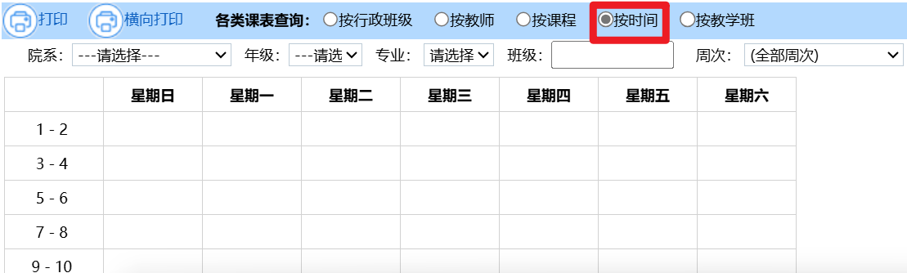

*该项目部分使用 AI 编写
# CSUClassroomQuery (CSU课室查询助手)

🏫 一个用于管理和查询中南大学教室使用情况的 Python 工具

## 简介
CSUClassroomQuery 是一个轻量级的教室资源管理工具，专门用于处理中南大学教室使用情况的查询和统计。它从课表 Excel 文件中提取数据，生成直观的空教室/占用教室表格，帮助学生快速找到可用教室。

## 版本说明
### 新版本（`classroom_schedule_processor.py` 和 `process_excel.py`）
新版本针对新的数据来源重新设计：

#### 数据来源：直接使用课程列表格式的Excel文件
本科生教务系统 - 我的课表 - 各类课表查询 - 按时间，点击"按时间"会弹出新窗口（藏得比较深）

弹出的窗口中，选择校区（本项目按校区分类），点击"查询"，耐心等待数分钟，查询结果显示完毕后，点击左上角打印。

在打印窗口中输入文件名（表头），点击打印，等待数分钟后得到 .xls 文件，将文件转为 .xlsx 文件后放入 source 目录下即可（注意修改 `classroom_schedule_processor.py` 中的文件名）。

#### 使用方法
1. 使用上述方法将课程列表的 .xlsx 文件放入 source 目录下
2. 运行 `process_excel.py` 生成教室列表
3. 运行 `classroom_schedule_processor.py` 生成空闲/占用教室表

#### 特点：
- 根据数据源特性，支持多个校区（天心、潇湘、杏林、岳麓山等等）
- 由于数据源更简洁的数据结构（每行一条课程记录），解析时间更短
- 使用 `process_excel.py` 自动从Excel生成教室列表
- 支持导出空闲/占用教室两种模式
- 公选课可以正确解析

#### 注意事项
- 确保 Excel 文件格式正确（参考示例文件）
- 源文件应放在source目录下
- 输出文件会保存在程序运行目录

### 旧版本（old_version/）
旧版本基于教务系统导出的班级课表格式设计：
#### 数据来源：本科生教务系统 - 我的课表 - 各类课表查询 - 打印

#### 特点：
- 由于原课表比较复杂，需要解析复杂的课程信息（包含在单个单元格中）
- 必须使用复杂的正则表达式解析教室和时间信息
- 提供手动查询和自动导出两种模式
- 解析时间较长
- 需要额外手动制作教室配置文件（classrooms.json）
- 由于源数据是以班级为单位，公选课不能正确解析

## 功能特色
- 📊 从课表Excel文件中解析教室使用数据
- 📝 支持导出空闲教室和占用教室表
- 🏢 支持多校区数据处理
- 📈 输出格式化的Excel报表

## 技术栈
- Python 3.x
- openpyxl：Excel文件处理
- pandas：数据处理和CSV生成
- tqdm：进度显示

## 使用场景
- 自习室查找

